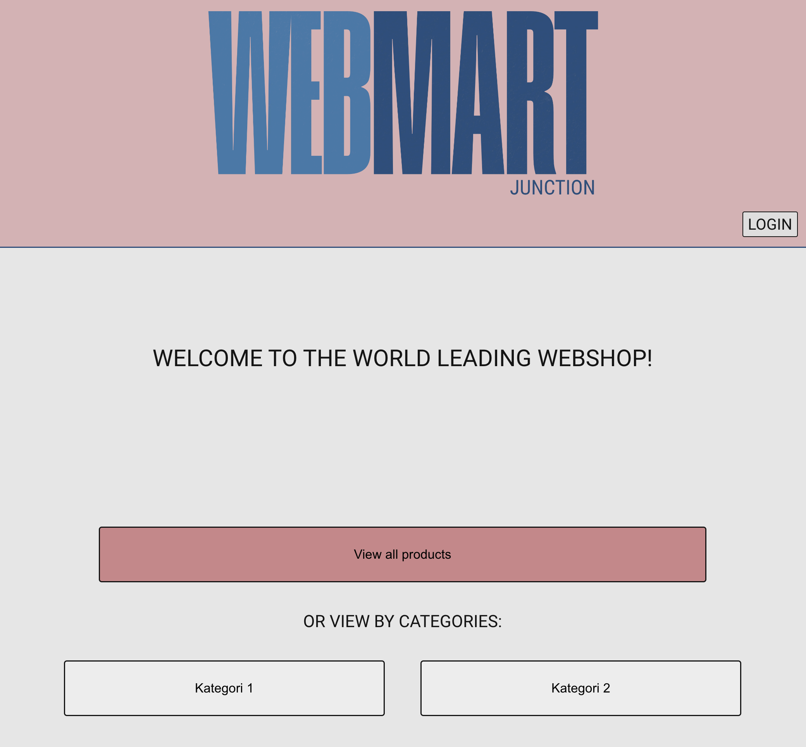
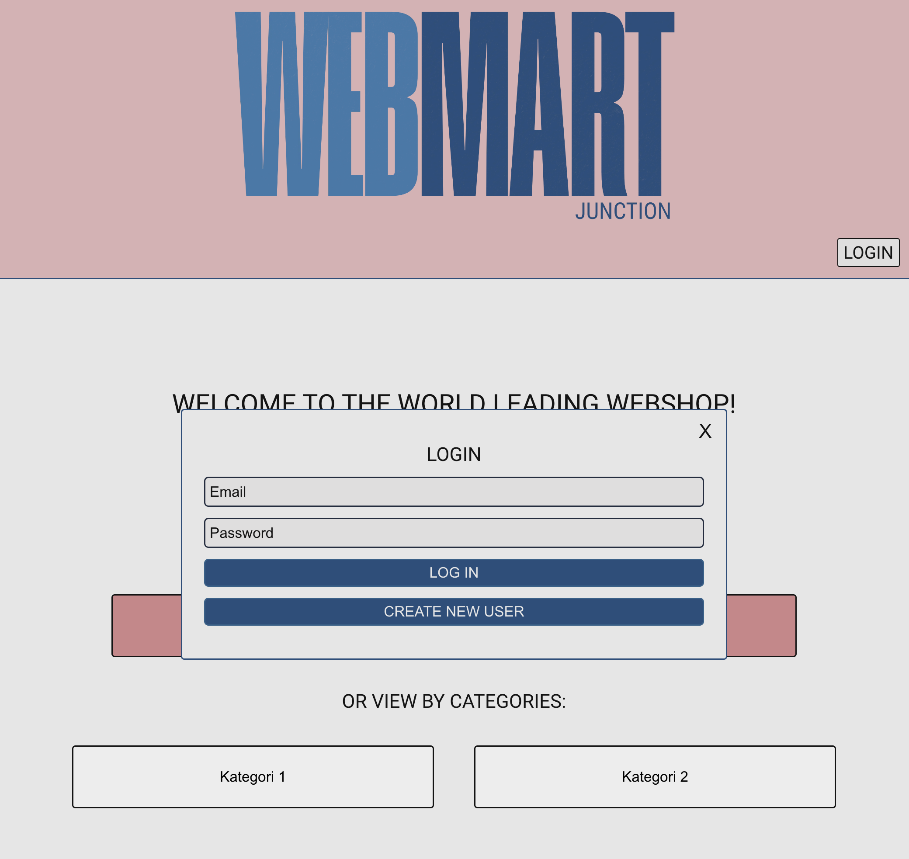
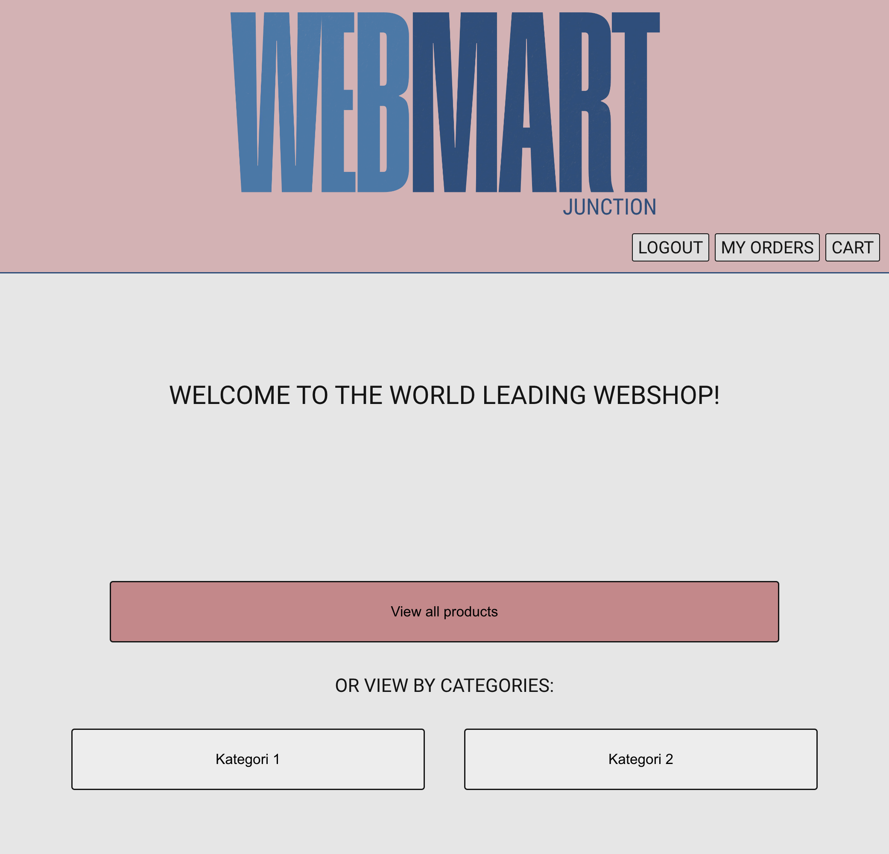
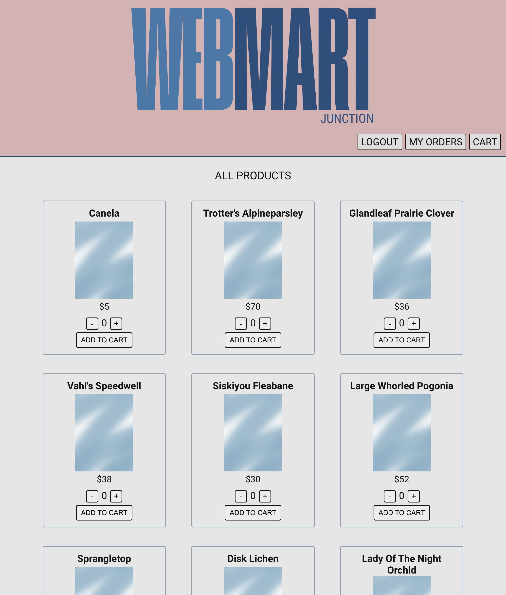
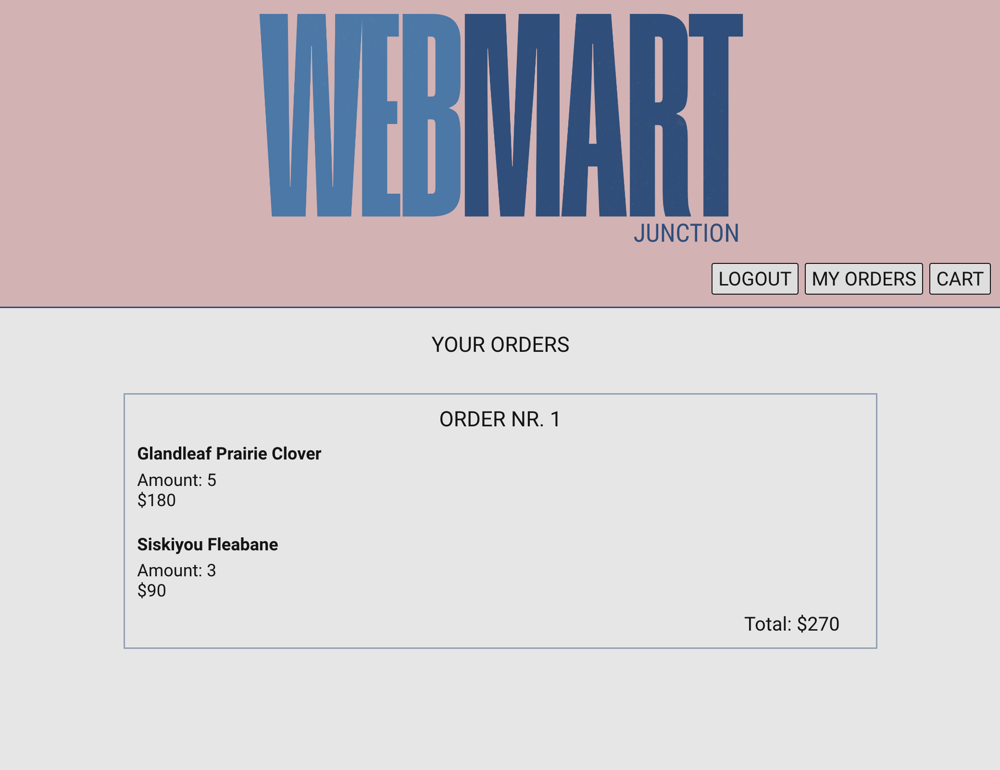
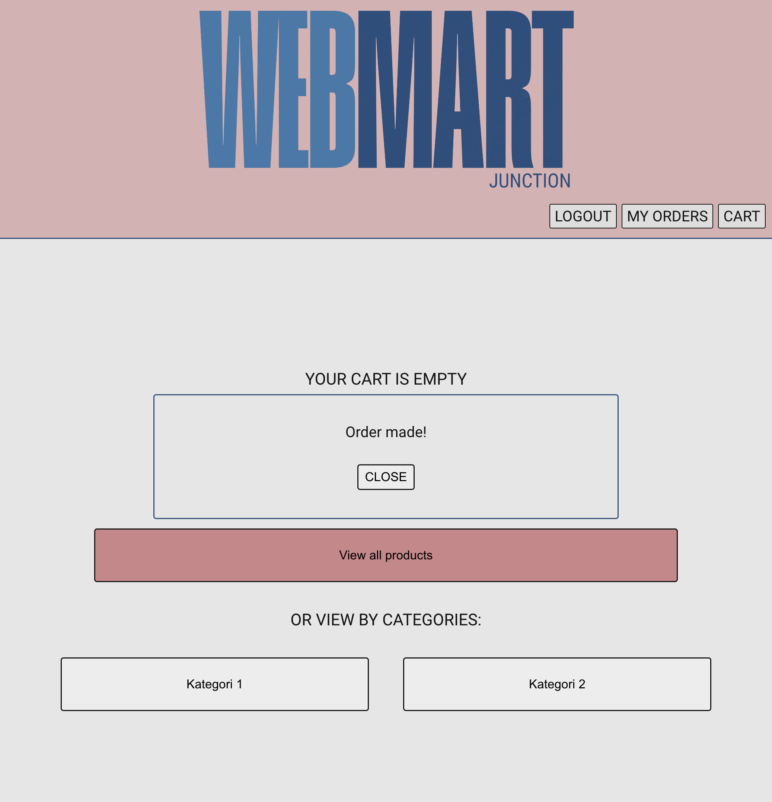

# WebMart Junction

WebMart Junction is your generic store. It could hold... almost anything. Is it a book store? Is it a food store? Depending on your database, you're the one to decide!

## Assignment

Here we have been tasked with developing the API for an e-commerce website. A solution architect has already documented the required endpoints and provided a test flow using REST-Client to kickstart development. We utilized MongoDB as our platform to grasp the fundamentals of NoSQL, focusing on creating, reading, updating, and deleting (CRUD) operations.

## Built with

#### Front end:

  

#### Back end:

 

## Screenshots

| Desktop Screeenshots                           |
| ---------------------------------------------- |
|            |
|          |
|  |
|       |
|             |
|          |
|            |

---

## Lessons Learned

Being the first assignment working with API and backend it was a lot to be learned. But dealing with both a front end and back end and to understand all the connections was very good to learn. How to handle databases with MongoDB and to fetch data in the front end. Also creating a single page application and rendering a lot more HTML from JavaScript.

## Author

[@olandstorm](https://github.com/olandstorm)
